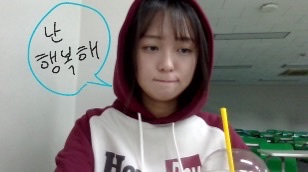

<!DOCTYPE html>
<html lang="ko">
<head>
    <meta charset="UTF-8">
    <meta name="viewport" content="width=device-width, initial-scale=1.0">
</head>
<body>
    

        <h1>정희원을 소개하는 페이지입니다.</h1>
        <h2>정희원</h2>
        
        

            <ul>
                <li>생년월일: 2004.12.23</li>
                <li>가족관계: 무남독녀</li>
                <li>
                    학력:
                    <ol>
                        <li>부천서초등학교 졸업</li>
                        <li>부천여자중학교 졸업</li>
                        <li>부명고등학교 졸업</li>
                        <li>
                            홍익대학교 재학 
                            소속: (서울)캠퍼스자율전공, 컴퓨터공학과
                        </li>
                    </ol>
                 </li>
                 <li>
                    SNS:
                    <ol>
                        <li>
                            <a href="https://www.instagram.com/jungheewonyy/" target="_blank" title="@jungheewonyy">정희원의 인스타그램</a>
                         </li>
                         <li>
                            <a href="https://blog.naver.com/heewonjung2" target="_blank" title="heewonjung2's blog">정희원의 블로그</a>
                         </li>
                    </ol>
                 </li>
            </ul>
        

</body>
</html>
